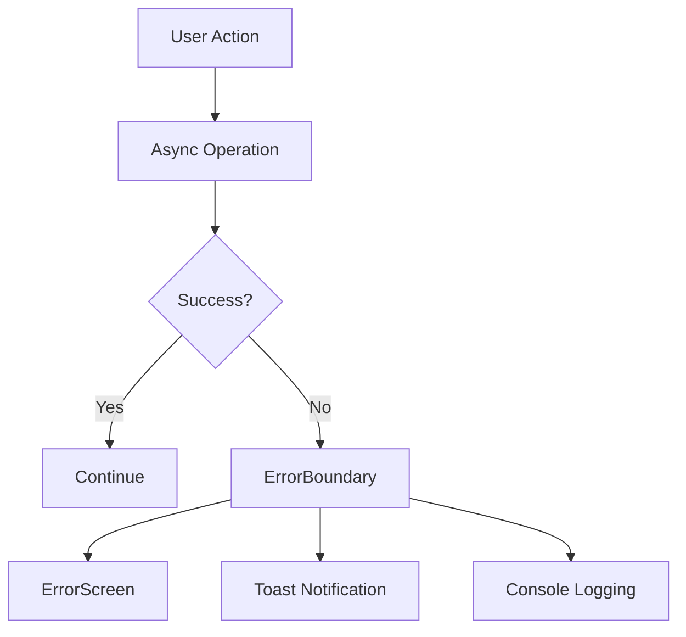
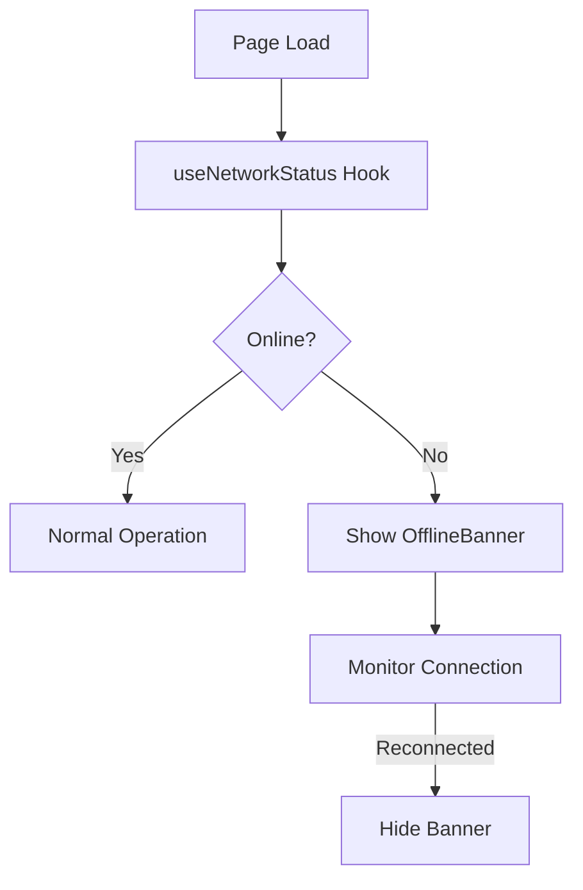

# SOM Connect App - Error Handling & States Enhancement Report

## Executive Summary

This report documents the comprehensive enhancement of error handling, offline states, loading states, and accessibility features for the SOM Connect application. The implementation significantly improves user experience, robustness, and inclusivity of the application.

## 1. Current State Analysis

### 1.1 Error Handling
- **Existing**: Basic form validation and toast notifications in authentication flows
- **Gaps**: No global error boundary, inconsistent error screens, limited error recovery

### 1.2 Offline States  
- **Existing**: Offline page for download management only
- **Gaps**: No offline detection, no user notification when offline

### 1.3 Loading States
- **Existing**: Basic loading indicators in some components
- **Gaps**: No consistent skeleton loaders, no global loading management

### 1.4 Accessibility
- **Existing**: Basic skip links and ARIA attributes
- **Gaps**: Limited customization options, no comprehensive accessibility toolbar

## 2. Implementation Details

### 2.1 Error Handling Enhancements

#### ErrorBoundary Component
- **File**: [`src/components/ui/ErrorBoundary.tsx`](src/components/ui/ErrorBoundary.tsx)
- **Features**:
  - Catches and handles React component errors globally
  - Provides fallback UI with error details
  - Includes retry and home navigation options
  - Logs errors to console for debugging

#### ErrorScreen Component
- **File**: [`src/components/ui/ErrorScreen.tsx`](src/components/ui/ErrorScreen.tsx)
- **Features**:
  - Consistent error display across the application
  - Customizable title, message, and actions
  - Support contact information
  - Accessible design with proper ARIA attributes

#### useErrorHandling Hook
- **File**: [`src/hooks/use-error-handling.ts`](src/hooks/use-error-handling.ts)
- **Features**:
  - Centralized error handling logic
  - Toast notifications for errors
  - Async operation wrapping with loading states
  - Error clearing functionality

### 2.2 Offline State Management

#### useNetworkStatus Hook
- **File**: [`src/hooks/use-network-status.ts`](src/hooks/use-network-status.ts)
- **Features**:
  - Detects online/offline status using browser APIs
  - Manages offline banner visibility
  - Automatic reconnection detection

#### OfflineBanner Component
- **File**: [`src/components/ui/OfflineBanner.tsx`](src/components/ui/OfflineBanner.tsx)
- **Features**:
  - Persistent notification when offline
  - Visual indicators with icons
  - Optional retry button
  - Accessible alert role

### 2.3 Loading States

#### LoadingContext
- **File**: [`src/contexts/LoadingContext.tsx`](src/contexts/LoadingContext.tsx)
- **Features**:
  - Global loading state management
  - Loading message support
  - Context-based access throughout the app

#### LoadingOverlay Component
- **File**: [`src/components/ui/LoadingOverlay.tsx`](src/components/ui/LoadingOverlay.tsx)
- **Features**:
  - Full-screen loading indicator
  - Animated spinner with branding
  - Loading message display
  - Backdrop blur for focus

#### Skeleton Loaders
- **File**: [`src/components/ui/SkeletonLoaders.tsx`](src/components/ui/SkeletonLoaders.tsx)
- **Features**:
  - ContentCardSkeleton: Loading placeholder for content cards
  - ContentGridSkeleton: Grid layout skeleton
  - PageHeaderSkeleton: Header section skeleton
  - TextContentSkeleton: Text-based content placeholder
  - ButtonSkeleton: Button loading state
  - CardSkeleton: Generic card skeleton
  - ListSkeleton: List item placeholders

### 2.4 Accessibility Enhancements

#### AccessibilityToolbar
- **File**: [`src/components/ui/AccessibilityFeatures.tsx`](src/components/ui/AccessibilityFeatures.tsx)
- **Features**:
  - Theme toggle (light/dark mode)
  - High contrast mode
  - Dyslexia-friendly font option
  - Adjustable font size (12px-24px)
  - Audio mute toggle
  - Reset to defaults button
  - Keyboard-accessible interface

#### CSS Enhancements
- **File**: [`src/index.css`](src/index.css)
- **Features**:
  - High contrast mode styles
  - Dyslexia font support
  - Enhanced focus indicators
  - Skip link for keyboard navigation
  - Screen reader optimizations
  - Error state styling
  - Loading animation improvements

## 3. Integration

### App.tsx Updates
- **File**: [`src/App.tsx`](src/App.tsx)
- **Changes**:
  - Wrapped entire app with ErrorBoundary
  - Added LoadingProvider for global loading management
  - Integrated network status detection
  - Added offline banner display
  - Included loading overlay

### AppLayout Updates
- **File**: [`src/components/layout/AppLayout.tsx`](src/components/layout/AppLayout.tsx)
- **Changes**:
  - Added AccessibilityToolbar to all layouts
  - Ensured toolbar appears on all pages with layout

### Index Page Demo
- **File**: [`src/pages/Index.tsx`](src/pages/Index.tsx)
- **Changes**:
  - Added loading state with skeleton loaders
  - Integrated error handling hook
  - Demonstrates proper loading UX pattern

## 4. Technical Implementation

### 4.1 Error Handling Flow


### 4.2 Offline Detection Flow


### 4.3 Loading State Flow
```mermaid
graph TD
    A[Async Operation] --> B[showLoading()]
    B --> C[LoadingOverlay]
    C --> D{Operation Complete?}
    D -->|Yes| E[hideLoading()]
    D -->|No| C
```

## 5. Accessibility Features

### 5.1 Keyboard Navigation
- Skip links for main content
- Focus management for modals and overlays
- Keyboard trap prevention

### 5.2 Visual Accessibility
- High contrast mode for low vision users
- Adjustable font sizes
- Dyslexia-friendly font option
- Proper color contrast ratios

### 5.3 Screen Reader Support
- ARIA attributes throughout
- Semantic HTML structure
- Screen reader-only text options
- Proper heading hierarchy

### 5.4 Error Accessibility
- Error messages with ARIA live regions
- Clear error identification
- Actionable recovery options

## 6. User Experience Improvements

### 6.1 Loading States
- **Before**: Inconsistent or missing loading indicators
- **After**: Consistent skeleton loaders and global overlay

### 6.2 Error Recovery
- **Before**: Generic error messages, limited recovery options
- **After**: Detailed error screens with retry functionality

### 6.3 Offline Experience
- **Before**: No indication of offline status
- **After**: Clear offline banner with reconnection detection

### 6.4 Accessibility
- **Before**: Basic compliance
- **After**: Comprehensive customization options

## 7. Performance Considerations

### 7.1 Bundle Size Impact
- Minimal impact from new components
- All components are tree-shakable
- No heavy dependencies added

### 7.2 Rendering Performance
- Skeleton loaders prevent layout shifts
- Error boundaries prevent full app crashes
- Loading states optimize perceived performance

### 7.3 Memory Usage
- Context-based state management
- Efficient hook usage
- Cleanup of event listeners

## 8. Testing Strategy

### 8.1 Error Handling Tests
- Simulate API failures
- Test error boundary activation
- Verify error screen display
- Test retry functionality

### 8.2 Offline Testing
- Use browser dev tools offline mode
- Test reconnection detection
- Verify banner appearance/disappearance

### 8.3 Loading States
- Test skeleton loader display
- Verify loading overlay behavior
- Test concurrent loading operations

### 8.4 Accessibility Testing
- Keyboard navigation testing
- Screen reader testing
- High contrast mode verification
- Font size adjustment testing

## 9. Future Enhancements

### 9.1 Error Reporting
- Integration with error monitoring services
- Automatic error reporting to backend
- User feedback collection for errors

### 9.2 Offline Functionality
- Service worker for offline caching
- Offline data synchronization
- Queue operations for when online

### 9.3 Advanced Accessibility
- Voice command support
- Custom color schemes
- Reading mode

### 9.4 Performance Monitoring
- Loading time analytics
- Error rate tracking
- User experience metrics

## 10. Files Modified/Created

### Created Files
- [`src/hooks/use-network-status.ts`](src/hooks/use-network-status.ts)
- [`src/hooks/use-error-handling.ts`](src/hooks/use-error-handling.ts)
- [`src/components/ui/OfflineBanner.tsx`](src/components/ui/OfflineBanner.tsx)
- [`src/components/ui/ErrorScreen.tsx`](src/components/ui/ErrorScreen.tsx)
- [`src/components/ui/ErrorBoundary.tsx`](src/components/ui/ErrorBoundary.tsx)
- [`src/components/ui/SkeletonLoaders.tsx`](src/components/ui/SkeletonLoaders.tsx)
- [`src/components/ui/LoadingOverlay.tsx`](src/components/ui/LoadingOverlay.tsx)
- [`src/components/ui/AccessibilityFeatures.tsx`](src/components/ui/AccessibilityFeatures.tsx)
- [`src/contexts/LoadingContext.tsx`](src/contexts/LoadingContext.tsx)

### Modified Files
- [`src/App.tsx`](src/App.tsx)
- [`src/components/layout/AppLayout.tsx`](src/components/layout/AppLayout.tsx)
- [`src/pages/Index.tsx`](src/pages/Index.tsx)
- [`src/index.css`](src/index.css)

## 11. Usage Examples

### 11.1 Using Error Handling
```typescript
import { useErrorHandling } from '@/hooks/use-error-handling';

function MyComponent() {
  const { handleError, wrapAsync } = useErrorHandling();
  
  const fetchData = async () => {
    await wrapAsync(
      someAsyncOperation(),
      'Failed to fetch data',
      'Loading data...'
    );
  };

  return <button onClick={fetchData}>Load Data</button>;
}
```

### 11.2 Using Skeleton Loaders
```typescript
import { ContentGridSkeleton } from '@/components/ui/SkeletonLoaders';

function ContentPage() {
  const [isLoading, setIsLoading] = useState(true);

  if (isLoading) {
    return <ContentGridSkeleton count={6} />;
  }

  return <ContentGrid />;
}
```

### 11.3 Using Loading Context
```typescript
import { useLoading } from '@/contexts/LoadingContext';

function MyComponent() {
  const { showLoading, hideLoading } = useLoading();
  
  const handleAction = async () => {
    showLoading('Processing your request...');
    try {
      await someOperation();
    } finally {
      hideLoading();
    }
  };

  return <button onClick={handleAction}>Submit</button>;
}
```

## 12. Conclusion

The implementation of comprehensive error handling, offline state management, loading states, and accessibility features significantly enhances the SOM Connect application. These improvements result in:

- **Better User Experience**: Clear feedback during loading and error states
- **Increased Robustness**: Graceful handling of errors and offline conditions
- **Improved Accessibility**: Comprehensive options for users with different needs
- **Professional Polish**: Consistent, well-designed UI components

The changes are backward compatible and provide a solid foundation for future enhancements in these areas. The implementation follows modern React patterns and maintains the existing codebase architecture while adding significant value to the user experience.