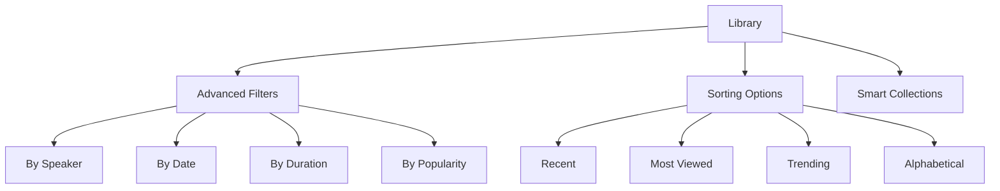
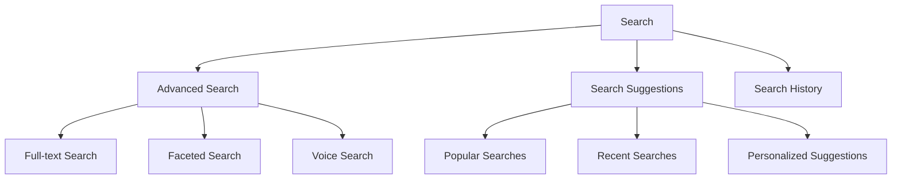
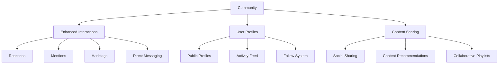
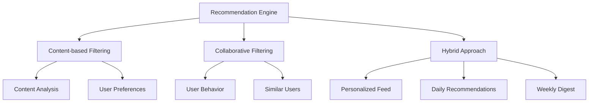
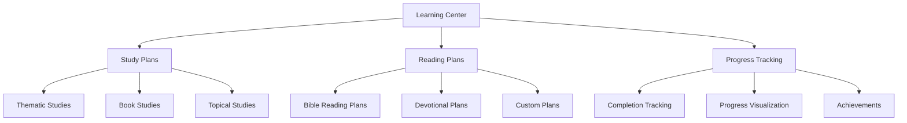
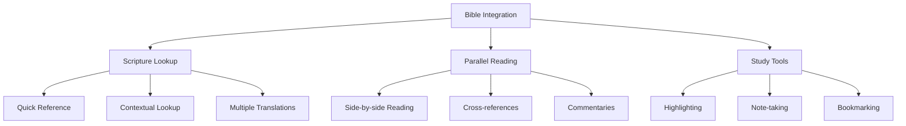
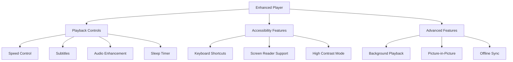
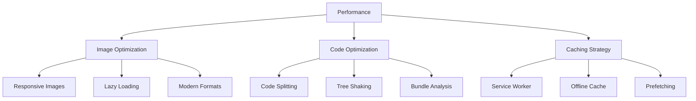
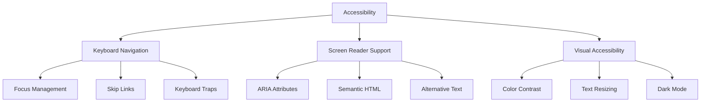
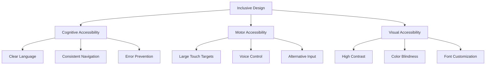

# SOM Connect App Analysis Report

## Executive Summary

This report provides a comprehensive analysis of the SOM Connect app, identifying its current state, gaps in functionality and user experience, and areas for improvement to meet industry standards. The app is a faith-based content platform designed to deliver spiritual teachings, community engagement, and daily devotional tools.

## 1. Current State Analysis

### 1.1 App Structure and Architecture

The SOM Connect app is built using a modern React-based architecture with the following key components:

- **Routing**: Uses React Router for navigation with a well-structured route hierarchy
- **State Management**: Implements React Query for data fetching and context API for global state
- **UI Framework**: Utilizes a custom UI component library with consistent styling
- **Authentication**: Has a comprehensive auth system with role-based access control
- **Responsive Design**: Implements responsive layouts with mobile and desktop adaptations

### 1.2 Existing Screens and Components

#### Core Screens

1. **Index/Home**: Featured content carousel, continue watching, daily tools preview, trending content, recommendations, and quick access cards
2. **Library**: Comprehensive content library with filtering (all, conferences, podcasts, originals, playlists, favorites)
3. **Content Detail**: Detailed view of individual content items with playback options
4. **Player**: Video/audio player with playback controls
5. **Community**: Social feed and groups functionality
6. **Q&A Sessions**: Live and archived Q&A sessions with question submission
7. **Tools**: Daily devotional tools (confessions, ROR readings)
8. **Profile**: User profile management and account settings

#### Authentication Screens

- Login, Register, Forgot Password, Onboarding, Splash

#### Administrative Screens

- Admin Dashboard, Moderation, User Management
- Content Upload and Submission Status

#### Layout Components

- **TopBar**: Navigation, search, notifications, user menu
- **BottomNav**: Mobile navigation
- **DesktopSidebar**: Desktop navigation with collapsible functionality
- **AppLayout**: Main application layout wrapper

### 1.3 Key Features

1. **Content Delivery**: Video/audio streaming with progress tracking
2. **Community Engagement**: Social feed, groups, and Q&A sessions
3. **Daily Tools**: Confessions, ROR readings, and publications
4. **User Management**: Profile, subscription, and settings
5. **Content Management**: Upload, review, and moderation workflows
6. **Search and Discovery**: Comprehensive search functionality
7. **Offline Access**: Download content for offline viewing
8. **Multi-platform Support**: Responsive design for mobile and desktop

## 2. Gaps and Areas for Improvement

### 2.1 Functionality Gaps

#### 2.1.1 Content Management

1. **Limited Content Organization**: No advanced filtering or sorting options in the library
2. **Basic Search**: Search functionality lacks advanced filters (by speaker, date, duration, etc.)
3. **No Content Bookmarking**: Users cannot bookmark specific timestamps in content
4. **Limited Playlist Functionality**: Playlists lack advanced features like reordering, sharing, or collaborative playlists

#### 2.1.2 User Engagement

1. **Basic Social Features**: Community lacks advanced features like direct messaging, mentions, or hashtags
2. **Limited Interaction**: No reaction system beyond likes and comments
3. **No Content Recommendations**: Recommendations are static and not personalized
4. **Limited Gamification**: Only basic streak tracking, no achievements or rewards system

#### 2.1.3 Learning and Spiritual Growth

1. **No Study Plans**: Missing structured learning paths or reading plans
2. **Limited Bible Integration**: No direct Bible reference lookup or parallel reading
3. **No Note-taking**: Users cannot take notes on content or save personal reflections
4. **Limited Scripture Engagement**: No verse highlighting, memorization tools, or cross-referencing

#### 2.1.4 Technical Limitations

1. **Basic Player**: Player lacks advanced features like speed control, subtitles, or audio enhancement
2. **Limited Offline Functionality**: Offline mode doesn't support all content types
3. **No Background Playback**: Audio content cannot play in the background
4. **Limited Accessibility**: Missing features for users with disabilities

### 2.2 User Experience Gaps

#### 2.2.1 Navigation and Discovery

1. **Complex Navigation**: Multiple navigation patterns (sidebar, bottom nav, top bar) can be confusing
2. **Inconsistent Information Architecture**: Content organization varies across different sections
3. **Limited Content Preview**: Users cannot preview content before clicking through
4. **No Content Ratings**: Missing user ratings or reviews to help with content selection

#### 2.2.2 Personalization

1. **Static Recommendations**: Content suggestions are not personalized based on user behavior
2. **Limited User Preferences**: Users cannot customize their experience beyond basic settings
3. **No Content History**: Missing comprehensive viewing history and analytics
4. **Limited Profile Customization**: Users cannot personalize their profiles extensively

#### 2.2.3 Community Engagement

1. **Basic Social Features**: Community interactions are limited to likes and comments
2. **No User Profiles in Community**: Cannot view other users' profiles or activity
3. **Limited Group Functionality**: Groups lack advanced features like events or shared resources
4. **No Content Sharing**: Users cannot easily share content with others

#### 2.2.4 Mobile Experience

1. **Limited Mobile Optimization**: Some features are not fully optimized for mobile
2. **Inconsistent Touch Targets**: Some interactive elements are too small for touch
3. **No Mobile-specific Features**: Missing mobile-specific optimizations like swipe gestures
4. **Limited Offline Indicators**: Unclear which content is available offline

### 2.3 Industry Standards Compliance

#### 2.3.1 Accessibility

1. **WCAG Compliance**: App does not fully comply with WCAG 2.1 AA standards
2. **Keyboard Navigation**: Some interactive elements are not fully keyboard accessible
3. **Screen Reader Support**: Limited ARIA attributes and screen reader support
4. **Color Contrast**: Some color combinations do not meet contrast requirements

#### 2.3.2 Performance

1. **Image Optimization**: Images are not optimized for performance
2. **Lazy Loading**: Limited implementation of lazy loading for non-critical resources
3. **Bundle Size**: No evidence of code splitting or bundle optimization
4. **Caching Strategy**: Limited caching strategy for offline support

#### 2.3.3 Security

1. **Authentication**: Basic auth implementation without advanced security features
2. **Data Protection**: Limited information about data encryption and protection
3. **Content Security**: No visible content security policies or protections
4. **Privacy Controls**: Limited user privacy controls and data management options

#### 2.3.4 Analytics and Insights

1. **Basic Analytics**: No visible analytics or insights for users
2. **Limited Content Analytics**: No detailed analytics for content creators
3. **No User Insights**: Users cannot see their own engagement patterns
4. **Limited Admin Analytics**: Admin dashboard lacks comprehensive analytics

## 3. Detailed Recommendations

### 3.1 Content Management Enhancements

#### 3.1.1 Advanced Content Organization

**Implementation Plan:**
- Add advanced filtering options with multiple criteria
- Implement sorting by various metrics (date, views, duration, etc.)
- Create smart collections based on user behavior and preferences
- Add saved searches and custom filters

#### 3.1.2 Enhanced Search Functionality

**Implementation Plan:**
- Implement full-text search across all content
- Add faceted search with filters for speaker, category, date range, etc.
- Integrate voice search for mobile users
- Add search suggestions and history
- Implement search analytics to improve results

### 3.2 User Engagement Features

#### 3.2.1 Advanced Social Features

**Implementation Plan:**
- Add reaction system (like, love, pray, amen, etc.)
- Implement mentions and hashtags for better discovery
- Add direct messaging between users
- Create public user profiles with activity feeds
- Implement follow system for users and content creators
- Add social sharing options for content
- Enable collaborative playlists

#### 3.2.2 Personalized Recommendations

**Implementation Plan:**
- Implement content-based filtering using content metadata
- Add collaborative filtering based on user behavior
- Create hybrid recommendation engine combining both approaches
- Generate personalized content feeds
- Provide daily recommendations and weekly digests
- Add "Because you watched X" recommendations

### 3.3 Learning and Spiritual Growth Tools

#### 3.3.1 Study Plans and Learning Paths

**Implementation Plan:**
- Create structured study plans with daily readings
- Implement Bible reading plans with progress tracking
- Add thematic and topical study guides
- Enable users to create custom reading plans
- Implement progress visualization with charts and graphs
- Add achievement system for completed studies

#### 3.3.2 Bible Integration

**Implementation Plan:**
- Integrate Bible API for scripture lookup
- Add quick reference tool for Bible verses
- Implement parallel reading with multiple translations
- Add cross-reference system
- Enable verse highlighting and note-taking
- Implement bookmarking for favorite verses
- Add study tools like commentaries and concordances

### 3.4 Technical Improvements

#### 3.4.1 Player Enhancements

**Implementation Plan:**
- Add playback speed control (0.5x to 2x)
- Implement subtitle support with multiple languages
- Add audio enhancement features
- Implement sleep timer for audio content
- Add keyboard shortcuts for player controls
- Improve screen reader support
- Add high contrast mode for accessibility
- Enable background playback for mobile
- Implement picture-in-picture mode
- Add offline content synchronization

#### 3.4.2 Performance Optimization

**Implementation Plan:**
- Implement responsive image loading
- Add lazy loading for images and iframes
- Use modern image formats (WebP, AVIF)
- Implement code splitting for routes
- Add tree shaking to remove unused code
- Perform bundle analysis and optimization
- Implement service worker for offline support
- Add comprehensive caching strategy
- Implement prefetching for likely navigation paths

### 3.5 Accessibility Improvements

#### 3.5.1 WCAG Compliance

**Implementation Plan:**
- Ensure all interactive elements are keyboard accessible
- Add proper focus management and skip links
- Eliminate keyboard traps
- Add comprehensive ARIA attributes
- Use semantic HTML throughout
- Ensure all images have proper alternative text
- Verify color contrast meets WCAG standards
- Support text resizing up to 200%
- Implement proper dark mode support

#### 3.5.2 Inclusive Design

**Implementation Plan:**
- Use clear, simple language throughout
- Maintain consistent navigation patterns
- Implement error prevention and recovery
- Ensure large touch targets for mobile
- Add voice control support
- Support alternative input methods
- Implement high contrast mode
- Add color blindness support
- Enable font customization

## 4. Implementation Roadmap

### 4.1 Phase 1: Foundation (0-3 months)

**Priority: High Impact, Low Complexity**

- Implement advanced search and filtering
- Add basic recommendation engine
- Enhance player with speed control and subtitles
- Improve accessibility (keyboard navigation, ARIA)
- Optimize images and implement lazy loading
- Add basic analytics and user insights

### 4.2 Phase 2: Engagement (3-6 months)

**Priority: User Growth and Retention**

- Implement social features (reactions, mentions, DMs)
- Add personalized recommendations
- Create study plans and reading paths
- Implement Bible integration
- Add user profiles and follow system
- Enhance community features

### 4.3 Phase 3: Advanced Features (6-12 months)

**Priority: Differentiation and Innovation**

- Implement AI-powered content recommendations
- Add advanced analytics and insights
- Create collaborative features
- Implement gamification system
- Add accessibility features (voice control, etc.)
- Develop mobile-specific optimizations

### 4.4 Phase 4: Optimization (Ongoing)

**Priority: Continuous Improvement**

- Performance monitoring and optimization
- User feedback integration
- A/B testing for features
- Accessibility audits
- Security enhancements
- Content quality improvements

## 5. Success Metrics

### 5.1 User Engagement Metrics

- **Daily Active Users (DAU)**: Increase by 30% within 6 months
- **Session Duration**: Increase average session time by 25%
- **Content Completion Rate**: Increase from current baseline by 20%
- **User Retention**: Improve 30-day retention by 15%
- **Social Interactions**: Increase community engagement by 40%

### 5.2 Content Consumption Metrics

- **Content Views**: Increase total views by 35%
- **Playlists Created**: Increase by 50%
- **Favorites/Saves**: Increase by 45%
- **Study Plan Completion**: Achieve 60% completion rate
- **Bible Lookups**: Track 10,000+ monthly lookups

### 5.3 Technical Metrics

- **Performance**: Achieve 90+ Lighthouse score
- **Accessibility**: Achieve WCAG 2.1 AA compliance
- **Error Rate**: Reduce critical errors by 80%
- **Load Time**: Reduce page load time by 40%
- **Offline Usage**: Increase offline content consumption by 30%

## 6. Risk Assessment

### 6.1 Technical Risks

- **Integration Complexity**: Adding multiple new features simultaneously
- **Performance Impact**: New features may affect app performance
- **Cross-platform Compatibility**: Ensuring features work across all devices
- **Data Migration**: Handling existing user data during upgrades

### 6.2 User Adoption Risks

- **Feature Overload**: Users may be overwhelmed by too many new features
- **Change Resistance**: Existing users may resist interface changes
- **Learning Curve**: New features may require user education
- **Accessibility Barriers**: New features must be accessible to all users

### 6.3 Mitigation Strategies

- **Phased Rollout**: Implement features gradually
- **User Testing**: Conduct extensive user testing before launch
- **Education**: Provide tutorials and help resources
- **Feedback Loops**: Establish channels for user feedback
- **Accessibility Audits**: Regular accessibility testing
- **Performance Monitoring**: Continuous performance tracking

## 7. Conclusion

The SOM Connect app has a solid foundation with comprehensive features for spiritual content delivery and community engagement. However, to meet industry standards and provide a truly exceptional user experience, significant improvements are needed in content organization, user engagement, learning tools, technical performance, and accessibility.

By implementing the recommended enhancements in a phased approach, the app can achieve:

1. **Improved User Engagement**: Through personalized recommendations and social features
2. **Enhanced Learning Experience**: With structured study plans and Bible integration
3. **Better Accessibility**: Meeting WCAG standards for inclusive design
4. **Superior Performance**: Optimized loading and smooth user experience
5. **Increased Retention**: Through gamification and achievement systems

The proposed roadmap balances immediate improvements with long-term innovation, ensuring the app remains competitive while delivering exceptional value to its users.

## 8. Recommendations Summary

### 8.1 Immediate Actions (0-3 months)

1. Implement advanced search and filtering
2. Add basic recommendation engine
3. Enhance player functionality
4. Improve accessibility compliance
5. Optimize performance

### 8.2 Short-term Actions (3-6 months)

1. Implement social engagement features
2. Add personalized recommendations
3. Create study plans and learning paths
4. Integrate Bible tools
5. Enhance user profiles

### 8.3 Long-term Actions (6-12 months)

1. Implement AI-powered features
2. Add advanced analytics
3. Develop collaborative tools
4. Implement gamification
5. Enhance mobile experience

### 8.4 Continuous Improvement

1. Regular performance monitoring
2. User feedback integration
3. Accessibility audits
4. Security enhancements
5. Content quality improvements

This comprehensive approach will transform SOM Connect into a world-class spiritual content platform that meets and exceeds industry standards while delivering exceptional value to its users.